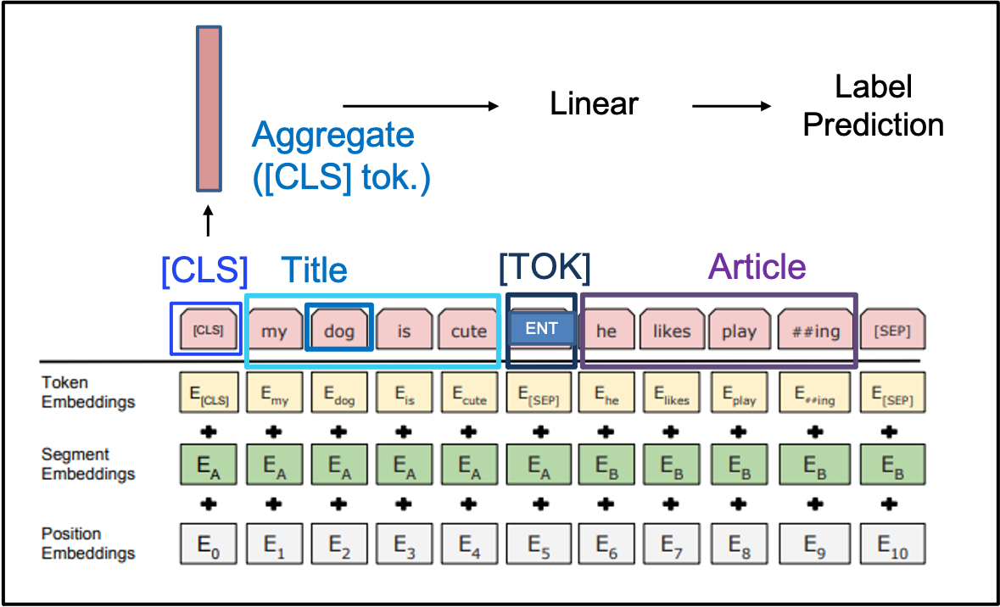

# BERT-Article-Recommender-with-Faiss
* BERTとfaissを用いた記事推薦の実装

# モデル


# 環境設定
```
$ conda create -n allennlp python=3.7
$ conda activate allennlp
$ pip install -r requirements.txt
$ download.sh
```

# 実験方法
$ `python3 main.py -num_epochs 10`

* 特にパラメータ調整は行っていない。dev acc. ~85%, test acc. ~83%.

# 記事
[https://qiita.com/izuna385/items/a004982f76256cab1b2d](https://qiita.com/izuna385/items/a004982f76256cab1b2d)

# その他
* faiss関連でエラーが起こる場合、faissを一度削除して以下を試して下さい。
   
   `pip install faiss-cpu --no-cache`
   
   (参考記事：https://github.com/facebookresearch/faiss/issues/821#issuecomment-573531694)